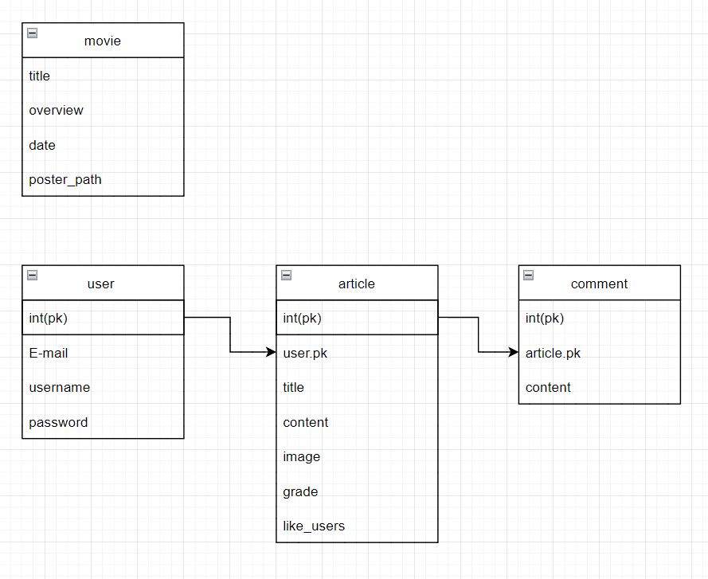

# 영화 추천 및 리뷰 사이트 제작

## 기능

- ### accounts

  - 회원가입
    - username
    - email
    - password
  - 로그인
    - 글 작성 권한
    - 좋아요 기능 권한
    - 댓글 작성 기능 권한
  - 로그아웃
  - 프로필 수정 (heroku  배포 후 보안성 이슈 발생으로 사용 불가)
  - 유저 정보
    - 좋아요한 글
    - 댓글단 글
    - 작성한 글
    - 팔로우, 팔로잉

  

- ### articles

  - 글 작성
  - 글 상세
    - 제목
    - 내용
    - 사진
    - 평점
    - 댓글
    - 좋아요
  - 글 수정
  - 글 삭제

  - 인기 영화 리스트
    - Tmdb api
  - 인기 영화 상세보기
    - 제목
    - 줄거리
    - 날짜
    - 포스터

## models

## 후기

혼자 진행하다보니 어디까지 개발해야할지 감을 잘 잡지 못했다.

디자인적으로 많이 아쉬웠다

data api를 가져와서 json 파일을 통해 django로 표현하는 것이 어색해서 시간이 많이 들어갔다.

아이디어가 많이 부족했다.

구글링도 실력인 것을 느꼈다.. 검색해도 잘 나오지 않았다.

일주일 반정도 되는 시간동안 진행한 것이 많이 없어서 시간을 허투로 사용한 것 같다

기반이 없으니 많이 방황했다.

S3는 진행하지도 못했다..

## 피드백

1. 혼자 진행하다보니 어디까지 개발해야할지 감을 잘 잡지 못했다.

- 팀 프로젝트에 참여해보는 것이 좋겠다. 내 능력이 부족하더라도 양해를 구해보자.

2. 디자인적으로 많이 아쉬웠다

- 사실 큰 욕심은 없었다. 하지만 어느 정도 아는 것이 중요하겠다.

3. data api를 가져와서 json 파일을 통해 django로 표현하는 것이 어색해서 시간이 많이 들어갔다.

- 내가 하고 싶었던 기능중 1위, 하지만 도저히 진행하는 방법이 생각나지 않아 며칠을 고생했다.
  지금도 어떻게 겨우 적용을 했지만 완전하지 않은 것 같다. 공부가 더 필요.

4. 아이디어가 많이 부족했다.

- 기본에 충실하자는 생각이 있었던 것 같다, 또한 API 데이터를 가져오는데 많은 시간을 투자해서 여유가 없었다.

5. 구글링도 실력인 것을 느꼈다.. 검색해도 잘 나오지 않았다.

- 버그 발생이나 API 데이터를 가져오는데 해외 사이트를 많이 참고했다. 아직 영어가 익숙하지 않은 것 같다.

6. 일주일 반정도 되는 시간동안 진행한 것이 많이 없어서 시간을 허투로 사용한 것 같다

- 일단 만들어보자 하는 생각이 제일 컸던 것 같다 다음에 프로젝트를 진행할 때에는
  기능 구현을 목표로 이루고자하는 계획을 세우는 것이 도움이 될 것 같다.

7. 기반이 없으니 많이 방황했다.

- 배우기는 많이 배운 것 같지만 정확히 아는 것은 하나도 없었다 이렇게 해왔으니까 흐름대로 코드를 작성했을 뿐이지 그 코드를 이해하려고 하지 않았던 나를 되돌아보며 반성하고 있다.

